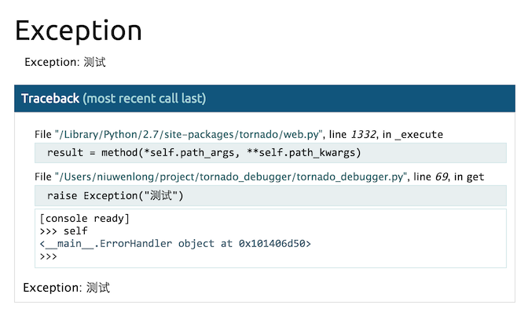

# Tornado debugger 工具
[Werkzeug](http://werkzeug.pocoo.org/) 提供一个交互式的debugger工具可以很方便的显示异常发生时的调用栈和上下文, 可以在 traceback 的上下文环境里执行语句来debug, 使调试更方便.

tornado_debugger 集成Werkzeug debugger工具到Tornado框架中, 可以在网页上方便地调试 Tornado.  
只需要做少量的修改，可以很方便的添加到你的 Tornado 项目中，支持异步操作。

**不要在生产环境中开启**, 因为异常发生后通过交互可以执行任意语句。

